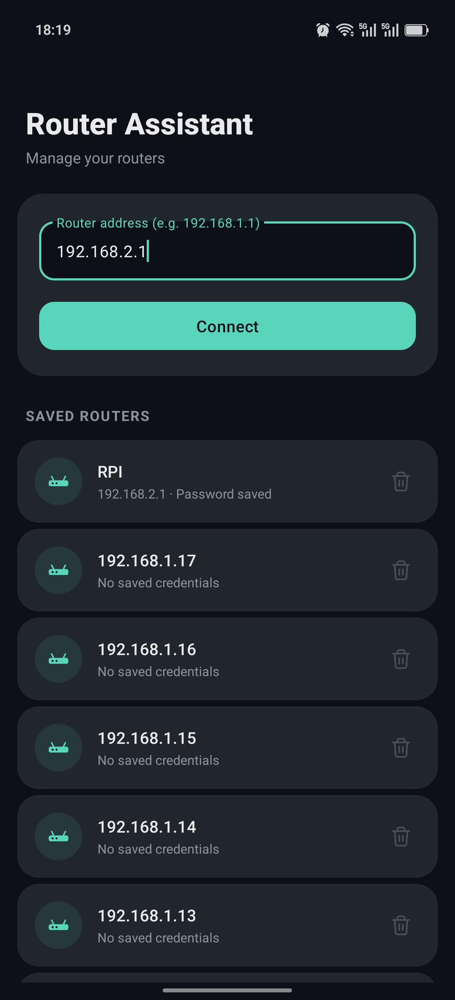
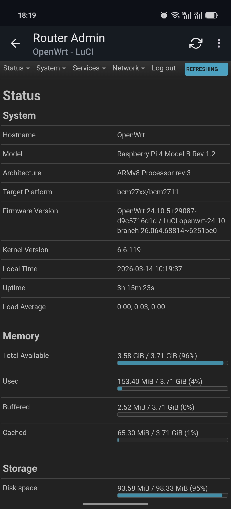

# RouterAssistant

A mobile router administration assistant for Android — manage your routers' web admin panels in a native, mobile-optimized experience.

[中文文档](README_CN.md)

> **Disclaimer**: This is a personal utility project, not a production-grade product. It has been tested on a limited number of devices and router models (OpenWrt, Xiaomi Router, China Mobile Optical Modem). Please use at your own risk.
>
> Bug reports and compatibility feedback are welcome via Issues. The codebase is intentionally small and straightforward — pull requests for improvements or broader device/router support are appreciated!

## Screenshots

| Home | Router Admin |
|------|-------------|
|  |  |

## Features

- **One-tap router access**: Save router addresses with custom aliases, connect with a single tap
- **Smart credential auto-fill**: Automatically saves and fills login credentials on router web login pages; supports diverse page structures including SPAs (Vue/React), iframe-based pages, and traditional forms
- **Login page detection**: Auto-fill only activates on login pages (pages with password fields) and automatically stops after login, preventing unwanted fills on configuration pages
- **Desktop & mobile layout**: Toggle desktop mode to force desktop-width viewport and user agent for full admin panel access
- **System theme following**: Automatically switches between light and dark themes based on the system setting (DayNight)
- **Bilingual UI**: Automatically displays Chinese or English based on the system language
- **Alias management**: Long-press saved routers to set custom aliases or view/copy saved passwords
- **Secure session handling**: Clearing a saved router also wipes associated cookies and web storage for a clean session
- **SSL certificate handling**: Graceful prompts for self-signed certificates common in router admin pages
- **Debug logging**: Built-in JavaScript console log viewer for troubleshooting auto-fill behavior

## Tech Stack

- **Language**: Java 11
- **UI**: Material Design 3 (Material You), DayNight theme, MaterialCardView
- **WebView**: Android WebView with custom WebViewClient/WebChromeClient
- **Auto-fill engine**: JavaScript injection with native prototype setters, MutationObserver, iframe scanning, and periodic polling
- **Data persistence**: SharedPreferences with JSON serialization
- **Min SDK**: 24 (Android 7.0)
- **Target SDK**: 34 (Android 14)

## Build

### Prerequisites

- Android Studio (Arctic Fox or later recommended)
- JDK 11+
- Android SDK with API 34

### Steps

```bash
# Clone the repository
git clone https://github.com/iiiwk/RouterAssistant.git
cd RouterAssistant

# Build debug APK
./gradlew assembleDebug

# The APK will be at app/build/outputs/apk/debug/app-debug.apk
```

Or simply open the project in Android Studio and run it.

## Project Structure

```
├── app/
│   └── src/main/
│       ├── java/com/routermanager/
│       │   ├── MainActivity.java        # Home screen with router list
│       │   ├── WebViewActivity.java      # WebView with auto-fill engine
│       │   ├── RouterAdapter.java        # RecyclerView adapter
│       │   ├── RouterInfo.java           # Router data model
│       │   └── PreferenceHelper.java     # SharedPreferences manager
│       └── res/
│           ├── layout/                   # Activity & item layouts
│           ├── values/                   # English strings, light colors, themes
│           ├── values-zh/                # Chinese strings
│           ├── values-night/             # Dark theme colors & theme
│           ├── drawable/                 # Icons & shape drawables
│           ├── color/                    # Color state lists
│           └── menu/                     # WebView toolbar menu
├── images/                               # Screenshots for README
├── build.gradle                          # Root build config
├── LICENSE
└── README.md
```

## Development

Code and documentation were written with the assistance of **Claude** in the Cursor IDE.

## License

[MIT](LICENSE)
