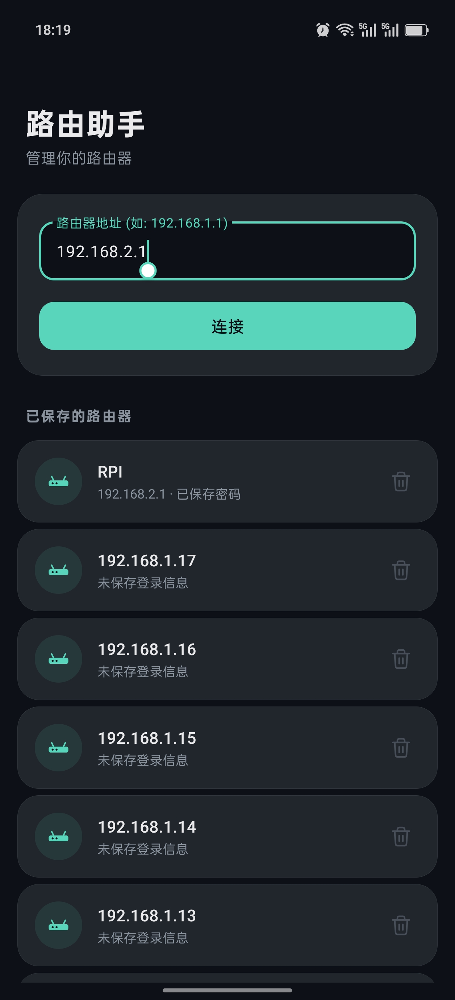
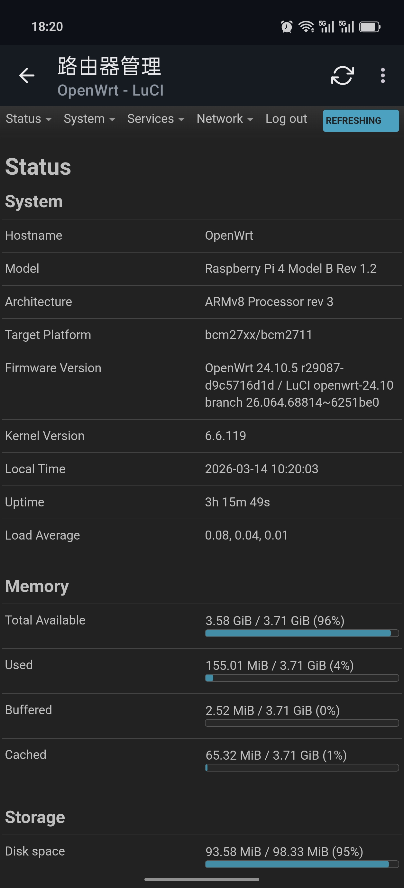

# RouterAssistant（路由助手）

一个 Android 移动端路由器管理助手 —— 以原生、移动端优化的方式管理路由器的 Web 后台管理页面。

[English](README.md)

> **免责声明**：这是一个个人工具项目，并非生产级产品。仅在有限的设备和路由器型号上进行了测试（OpenWrt、小米路由器、中国移动光猫）。请自行承担使用风险。
>
> 欢迎通过 Issues 反馈 Bug 和兼容性问题。代码结构力求简洁清晰，也欢迎提交 Pull Request 来改进功能或扩展设备/路由器的兼容性！

## 截图

| 主页 | 路由器管理 |
|------|-----------|
|  |  |

## 功能特性

- **一键连接路由器**：保存路由器地址并设置自定义别名，点击即可快速连接
- **智能凭据自动填充**：自动保存和填充路由器 Web 登录页面的登录信息；支持多种页面结构，包括 SPA 单页应用（Vue/React）、iframe 嵌套页面和传统表单
- **登录页面检测**：自动填充仅在登录页面（含密码输入框的页面）激活，登录成功后自动停止，避免在配置页面误填
- **桌面版 & 移动版布局**：支持切换桌面模式，强制使用桌面宽度视口和 User Agent，获取完整的管理面板
- **系统主题色跟随**：根据系统设置自动切换浅色/深色主题（DayNight）
- **中英文双语界面**：根据系统语言自动显示中文或英文
- **别名管理**：长按已保存的路由器可设置自定义别名、查看或复制保存的密码
- **安全会话管理**：删除已保存的路由器时同步清除关联的 Cookie 和 Web 存储，确保全新会话
- **SSL 证书处理**：针对路由器管理页面常见的自签名证书提供友好提示
- **调试日志**：内置 JavaScript 控制台日志查看器，方便排查自动填充行为

## 技术栈

- **语言**：Java 11
- **UI**：Material Design 3 (Material You)，DayNight 主题，MaterialCardView
- **WebView**：Android WebView，自定义 WebViewClient/WebChromeClient
- **自动填充引擎**：JavaScript 注入，使用原生原型 setter、MutationObserver、iframe 扫描和轮询机制
- **数据持久化**：SharedPreferences + JSON 序列化
- **最低 SDK**：24（Android 7.0）
- **目标 SDK**：34（Android 14）

## 构建

### 前置要求

- Android Studio（推荐 Arctic Fox 或更高版本）
- JDK 11+
- Android SDK（API 34）

### 步骤

```bash
# 克隆仓库
git clone https://github.com/iiiwk/RouterAssistant.git
cd RouterAssistant

# 构建调试 APK
./gradlew assembleDebug

# APK 输出路径：app/build/outputs/apk/debug/app-debug.apk
```

或直接在 Android Studio 中打开项目运行。

## 项目结构

```
├── app/
│   └── src/main/
│       ├── java/com/routerassistant/
│       │   ├── MainActivity.java        # 主页，路由器列表
│       │   ├── WebViewActivity.java      # WebView 页面，含自动填充引擎
│       │   ├── RouterAdapter.java        # RecyclerView 适配器
│       │   ├── RouterInfo.java           # 路由器数据模型
│       │   └── PreferenceHelper.java     # SharedPreferences 管理器
│       └── res/
│           ├── layout/                   # Activity 和列表项布局
│           ├── values/                   # 英文字符串、浅色主题颜色、样式
│           ├── values-zh/                # 中文字符串
│           ├── values-night/             # 深色主题颜色和样式
│           ├── drawable/                 # 图标和形状资源
│           ├── color/                    # 颜色状态列表
│           └── menu/                     # WebView 工具栏菜单
├── images/                               # README 截图
├── build.gradle                          # 根构建配置
├── LICENSE
└── README.md
```

## 开发

代码和文档在 Cursor IDE 中借助 **Claude** 辅助编写。

## 许可证

[MIT](LICENSE)
